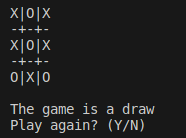

# Tic Tac Toe

This is a simple command-line tic-tac-toe game using ncurses. You select X or O and click the square you would like to place a tile in. X always goes first.

## Dependencies
This program requires ncurses to be installed on your system. 

On Debian/Ubuntu systems, ncurses can be installed with:

`$ sudo apt install libncurses5-dev libncursesw5-dev`

## Usage
The program is compiled with `make` and can be run with `./TicTacToe`

## Implementation
The program brute forces the entire tic-tac-toe game tree. It then does alpha-beta pruning on that tree to find the best move. I implement a Tic class similar to how I see chess classes implemented. Tic can return the number of legal moves, play moves, determine if the position is a win, etc.

## Possible Improvements:
The program can be made faster by saving the tree to a file, and reading from the file instead of calculating the tree each run of the program. 

The game tree has 549946 nodes, which is kind of a lot as I don't take transpositions into account. However, even when generating 549946 nodes without multithreading, the gameplay is instantaneous.

## License
This project uses the MIT license.
